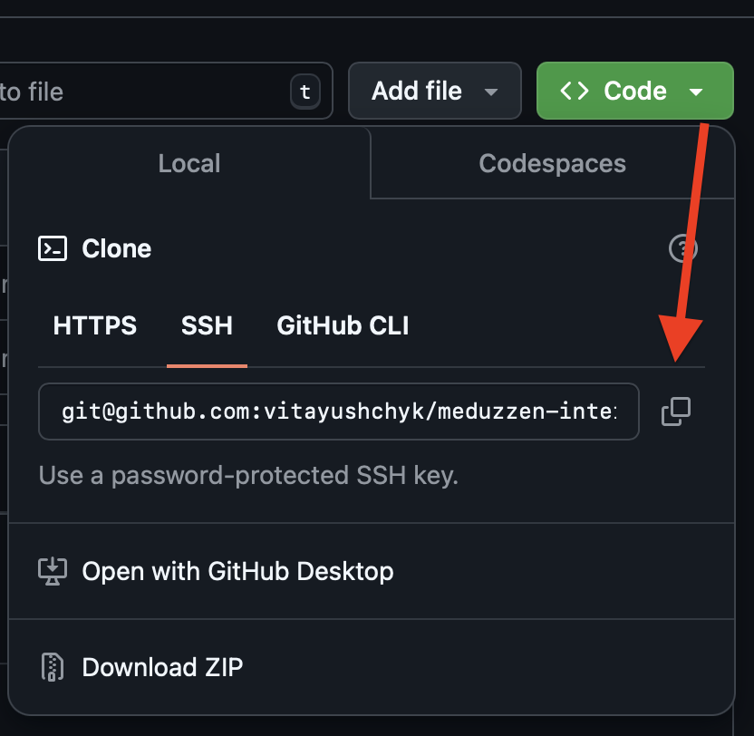

# **Quiz**

## Overview

[Quiz](http://ec2-3-75-177-31.eu-central-1.compute.amazonaws.com:8080/docs#/) is an interactive application for
conducting tests, surveys or training quizzes.
shopping.

## Tech Stack

## Installation:

### Clone this repository using GitHub Desktop:

## Preparations:

### .env:

Please, make sure that you have a .env in the root folder. Feel free to specify values of environmental variables as you
wish, but make sure that your .env file structured like .env.example.

## Run app:

- Run application:

      fastapi dev main.py

## Run app with Docker:

Firstly, you need to have [Docker](https://docs.docker.com/get-docker/) installed in your system.

- Run application:

      make run_app

## Apply migrations with Alembic

- Create migration. Usage `make create_migrations m="migration message"`:

      make create_migrations

- Apply migrations:

      make migrate

## Run test:

- Run test

      make run_test

## Interactive API docs:

      http://host:port/docs

After you will see the automatic interactive API documentation (provided by Swagger UI):

- Run tests:
  pytest

## Poetry:

In this project used [Poetry](https://python-poetry.org/) environment

- Load all needed packages

      poetry install

- Add new package

      poetry add <package_name>

### Deployment

- This project is deployed on [AWS](https://aws.amazon.com).

## Contributors:

- [Vita Yushchyk](https://www.linkedin.com/in/vita-yushchyk-484680205/)