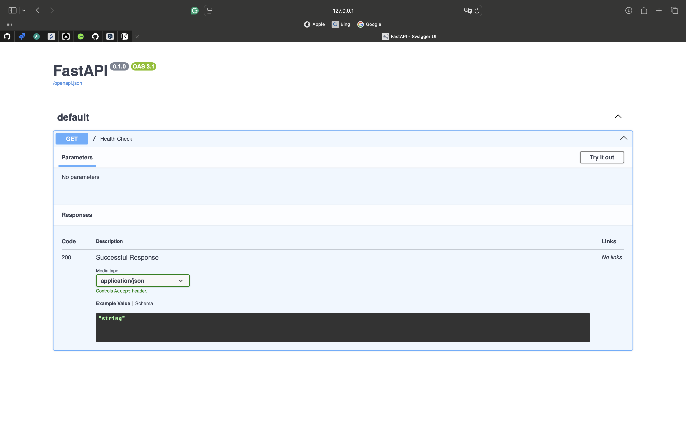

# **Meduzzen intership**

## Installation:

### Clone this repository using GitHub Desktop:

## Preparations:

### .env:

Please, make sure that you have a .env in the root folder. Feel free to specify values of environmental variables as you
wish, but make sure that your .env file structured like .env.example.

## Commands:

- Run application:

      fastapi dev main.py
-
- Interactive API docs:

      http://host:port/docs

After you will see the automatic interactive API documentation (provided by Swagger UI):

- Run tests:
  pytest

## Poetry:

In this project used [Poetry](https://python-poetry.org/) environment

- Load all needed packages

      poetry install

- Add new package

      poetry add <package_name>

## Contributors:

- [Vita Yushchyk](https://github.com/vitayushchyk)